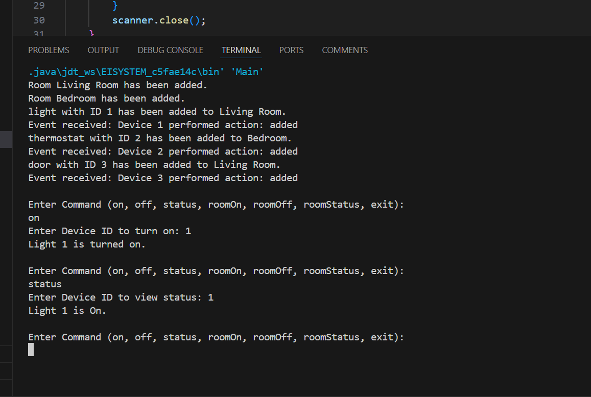

# Smart Home System

## Overview
The Smart Home System project is a simulation that allows users to control various smart devices such as lights, thermostats, and door locks through a central hub. Users can interact with the system via a command-line interface or a graphical user interface (GUI).

## Features
- **Device Management**: Add, remove, and control devices.
- **Room Management**: Organize devices by rooms.
- **Status Reporting**: View the status of devices and rooms.
- **Event Notifications**: Real-time updates on device status.

## System Requirements
- Java JDK 8 or higher
- IDE (Eclipse, IntelliJ, or similar) for easy compilation and execution

## Project Structure
/SmartHomeSystem 
  ├── /devices 
  ├── /factory 
  ├── /observer 
  ├── /proxy 
  ├── /system 
  ├── /gui 
  ├── /console 
  └── Readme.md


1. **Clone the repository**:
   ```bash
   git clone <repository-url>
   cd /Exersice2-Smart-Home-System/src

2. Compile the project:
  javac -d ../bin devices/*.java factory/*.java observer/*.java proxy/*.java system/*.java Z_Main-File-With-Gui/*.java Z_Main-File-Without-Gui/*.java

3. Run the Console Application:
  java -cp ../bin Main

4. Run the GUI Application:
  java -cp ../bin MainGUI


## GUI Screenshot


## Console Output Screenshot


